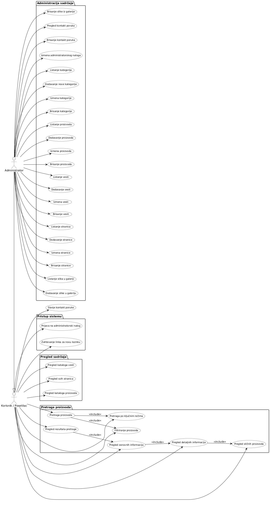

# Veb Aplikacija za supermarket

## Cilj razvoja

Ovo je projekat za ispit iz predmeta Praktikum - Internet i veb tehnologije.

Ime i prezime: Nenad Miražić
Broj indeksa: 2015/200-454
Školska godina: 2022/2023

********************************************************************************

## Projektni zahtev

Realizovati veb sajt supermarketa koji ima ulogu veb prezentacije sa više kategorija sadržaja, među kojima su stranice, vesti raspoređene u kategorije, galerija slika, kontakt formular, kao i katalog proizvoda (sa hijerarhijom minimum tri sloja, npr. Hrana » Mlečni proizvodi » Kačkavalji). Veb sajt treba da ima bazu podataka u kojoj se svaka od ovih vrsta sadržaja čuva u tabeli koja odgovara strukturi podataka svake od stavki (stranica, vest, kategorija, slika u galeriji, proizvod i kontakt poruka).

 Administratorima sadržaja, koji se na poseban deo za uređivanje sadržaja prijavljuju sa pristupnim parametrima, treba omogućiti da vide listu svake od stavki, da mogu da dodaju novu, izmene ili obrišu postojeću.

 Korisnici sajta (posetioci) treba da imaju opciju za pretragu po ključnim rečima, kao i po određenim filterima (neku od kategorija u hijerarhiji) odakle će u rezultatima pretrage videti fotografiju, naziv i cenu proizvoda, a kada kliknu na link, biće im prikazana stranica sa svim detaljima. Na stranicama sa detaljima proizvoda treba da bude prikazana lista ponuđenih sličnih proizvoda iz te kategorije. Grafički interfejs veb sajta treba da bude realizovan sa responsive dizajnom.

## Tehnička ograničenja

- Aplikacija mora da bude realizovana na Node.js platformi korišćenjem Express biblioteke. Aplikacija mora da bude podeljena u dve nezavisne celine: back-end veb servis (API) i front-end (GUI aplikacija). Sav kôd aplikacije treba da bude organizovan u jednom Git spremištu u okviru korisničkog naloga za ovaj projekat, sa podelom kao u primeru zadatka sa vežbi.
- Baza podataka mora da bude relaciona i treba koristiti MySQL ili MariaDB sistem za upravljanje bazama podataka (RDBMS) i u spremištu back-end dela aplikacije mora da bude dostupan SQL dump strukture baze podataka, eventualno sa inicijalnim podacima, potrebnim za demonstraciju rada projekta.
- Back-end i front-end delovi projekta moraju da budi pisani na TypeScript jeziku, prevedeni TypeScript prevodiocem na adekvatan JavaScript. Back-end deo aplikacije, preveden na JavaScript iz izvornog TypeScript koda se pokreće kao Node.js aplikacija, a front-end deo se statički servira sa rute statičkih resursa back-end dela aplikacije i izvršava se na strani klijenta. Za postupak provere identiteta korisnika koji upućuje zahteve back-end delu aplikacije može da se koristi mehanizam sesija ili JWT (JSON Web Tokena), po slobodnom izboru.
- Sav generisani HTML kôd koji proizvodi front-end deo aplikacije mora da bude 100% validan, tj. da prođe proveru W3C Validatorom (dopuštena su upozorenja - Warning, ali ne i greške - Error). Grafički korisnički interfejs se generiše na strani klijenta (client side rendering), korišćenjem React biblioteke, dok podatke doprema asinhrono iz back-end dela aplikacije (iz API-ja). Nije neophodno baviti se izradom posebnog dizajna grafičkog interfejsa aplikacije, već je moguće koristiti CSS biblioteke kao što je Bootstrap CSS biblioteka. Front-end deo aplikacije treba da bude realizovan tako da se prilagođava različitim veličinama ekrana (responsive design).
- Potrebno je obezbediti proveru podataka koji se od korisnika iz front-end dela upućuju back-end delu aplikacije. Moguća su tri sloja zaštite i to: (1) JavaScript validacija vrednosti na front-end-u; (2) Provera korišćenjem adekvatnih testova ili regularnih izraza na strani servera u back-end-u (moguće je i korišćenjem izričitih šema - Schema za validaciju ili drugim pristupima) i (3) provera na nivou baze podataka korišćenjem okidača nad samim tabelama baze podataka.
- Neophodno je napisati prateću projektnu dokumentaciju o izradi aplikacije koja sadrži (1) model baze podataka sa detaljnim opisom svih tabela, njihovih polja i relacija; (2) dijagram baze podataka; (3) dijagram organizacije delova sistema, gde se vidi veza između baze, back-end, front-end i korisnika sa opisom smera kretanja informacija; (4) popis svih aktivnosti koje su podržane kroz aplikaciju za sve uloge korisnika aplikacije prikazane u obliku Use-Case dijagrama; kao i (5) sve ostale elemente dokumentacije predviđene uputstvom za izradu dokumentacije po ISO standardu.
- Izrada oba dela aplikacije (projekata) i promene kodova datoteka tih projekata moraju da bude praćene korišćenjem alata za verziranje koda Git, a kompletan kôd aplikacije bude dostupan na javnom Git spremištu, npr. na besplatnim GitHub ili Bitbucket servisima, jedno spremište za back-end projekat i jedno za front-end projekat. Ne može ceo projekat da bude otpremljen u samo nekoliko masovnih Git commit-a, već mora da bude pokazano da je projekat realizovan u kontinuitetu, da su korišćene grane (branching), da je bilo paralelnog rada u više grana koje su spojene (merging) sa ili bez konflikata (conflict resolution).

## Baza podataka

- Model relacione baze podataka

- Diagram relacione baze podataka

- Detaljan opis tabela baze podataka

 administrator                                                                  Administrator

• administrator_id          INT        10      PK   NN     UN   AI              primarni ključ
• username                  VARCHAR    64              UQ                       korisničko ime
• email                     VARCHAR    64              UQ                       adresa el. pošte
• password_hash             VARCHAR   128                                       heš lozinke
• password_reset_link       TEXT                       UQ      D NULL           link za resetovanje pass
• is_active                 TINYINT      1                 UN  D 1              status naloga| 1 = active
• created_at                TIMESTAMP                          D CT             vreme kreiranja naloga

page                                                                            Stranica

• page_id                   INT         10     PK   NN     UN   AI              primarni ključ
• title                     VARCHAR     64             UQ                       naslov
• alt_text                  VARCHAR     64                     D NULL           dodatni opis, seo tagovi
• content                   TEXT                                                sadržaj
• is_deleted                TINYINT      1          NN     UN  D 0              oznаčen kao izbrisan(0=ne)
• created_at                TIMESTAMP                          D CT             vreme kreiranja
• modified_at               TIMESTAMP                          D CT             vreme ažuriranja

category                                                                        Kategorija

• category_id               INT         10     PK   NN     UN   AI              primarni ključ
• name                      VARCHAR     64             UQ1                      naziv
• category_type             ENUM     {product, news, root}     D NULL           tip kategorije (za proizvod ili vesti)
• is_deleted                TINYINT      1          NN     UN  D 0              oznаčen kao izbrisan(0=ne)
• parent_id                 INT         10             UQ1 UN  D NULL  FK       FK upućuje na PK u istoj tabel(adjacency list)

photo                                                                           Slika

• photo_id                  INT         10     PK   NN     UN   AI              primarni ključ
• name                      VARCHAR     64             UQ                       naziv
• alt_text                  VARCHAR     64                     D NULL           dodatni opis, seo tagovi
• file_path                 TEXT                       UQ                       putanja datoteke
• product_id                INT         10                 UN          FK       strain ključ ka tabeli proizvod
• is_deleted                TINYINT      1          NN     UN   D 0             oznаčen kao izbrisan(da/ne)
• page_id                   INT         10                 UN          FK       strain ključ ka tabeli stranica
• news_id                   INT         10                 UN          FK       strain ključ ka tabeli vesti

product                                                                         Proizvod

• product_id                INT         10     PK   NN     UN   AI              primarni ključ
• name                      VARCHAR     64             UQ1                      naziv  
• alt_text                  VARCHAR     64                     D NULL           dodatni opis, seo tagovi
• description               TEXT                    NN                          opis
• price                     DECIMAL     10,2        NN     UN                   cena
• sku                       BIGINT      12          NN UQ  UN                   jedinstveni broj proizvoda
• supply                    INT         10          NN     UN                   stanje u magacinu
• is_on_discount            TINYINT     0           NN     UN   D 0             status popusta(aktivan/neaktivan)
• discount                  ENU  {[0.10-0.9}}                                   vrednost popusta u %
• is_deleted                TINYINT      1          NN     UN   D 0             oznаčen kao izbrisan(da/ne)
• created_at                TIMESTAMP    1                      D CT            vreme kreiranja
• modified_at               TIMESTAMP    1                      D CT            vreme ažuriranja
• category_id               INT         10             UQ1 UN          FK       straini ključ ka tabeli kategorija

news                                                                            Vesti

• news_id                  INT         10     PK   NN      UN   AI              primarni ključ
• title                    VARCHAR     64              UQ1                       naslov
• content                  TEXT                                                 sadržaj/tekst
• alt_text                 VARCHAR     128                     D NULL           dodatni opis, seo tagovi
• created_at               TIMESTAMP                           D CT             vreme kreiranja
• is_deleted               TINYINT       1         NN      UN  D 0              oznаčen kao izbrisan(da/ne)
• modified_at              TIMESTAMP                           D CT             vreme ažuriranja
• category_id              INT          10             UQ1 UN          FK       straini ključ ka tabeli kategorija

contact                                                                         kontakt

• contact_id                INT         10    PK   NN      UN   AI              primarni ključ
• firstname                 VARCHAR     64                                      ime
• lastname                  VARCHAR     64                                      prezime
• email                     VARCHAR     64                                      adresa el. pošte
• title                     VARCHAR     64                                      naslov
• message                   TEXT                                                poruka/pitanje
• created_at                TIMESTAMP                          D CT             vreme kreiranja

## Dijagram organizacije komponenata aplikacije

### Uloge korisnika

- Spisak aktivnosti po ulogama

## Use-case dijagrami

- Aktivnosti po ulogama

- Identifikacija uopštenih aktivnosti po ulogama

- Razrada uopštenih aktivnosti po ulogama

## Prikaz konačnog spiska pojedinačnih aktivnosti

- Administrator

- Uređivanje/pregled sadržaja      (uređuje i izlistava sadržaj)
  - Listanje kategorija            (izlistava sve kategorije, odnosno potkategorije klikom na određenu kategoriju)
  - Dodavanje nove kategorije      (dodaje novu kategotiju/potkategoriju prethodno odabranoj potkategoriji)
  - Izmena kategorije              (menja ime, tip i potkategoriju određene kategorije/potkategorije)
  - Brisanje kategorije            (biše ukoliko odabrana kategorija/potkategorija nema dece)
  - Listanje proizvoda             (izlistava sve proizvode odabrane kategorije/potkategorije)
  - Dodavanje proizvoda            (dodaje novi proizvod u odabranu kategoriju/potkategoriju zajedno sa slikama proizvoda)
  - Brisanje proizvoda             (briše odabrani proizvod iz njegove kategorije/potkategorije zajedno sa pripadajućim slikama)
  - Izmena proizvoda               (menja ime,opis,cenu,stanje zaliha,da li je na popustu,vrednost popusta,kategoriju/potkategoriju)
  - Listanje vesti                 (izlistava sve vesti odabrane kategorije/potkategorije)
  - Dodavanje vesti                (dodaje novu vest u odabranu kategoriju/potkategoriju zajedno sa slikama )
  - Brisanje vesti                 (briše odabranu vest iz njene kategorije/potkategorije zajedno sa pripadajućim slikama)
  - Izmena vesti                   (menja naslov, sadržaj, alt text, sliku, kategoriju/potkategoriju)
  - Listanje stranica              (izlistava pojedinačne stranice prema odabranom naslovu)
  - Dodavanje stranice             (dodaje novu stranicu)
  - Izmena stranice                (menja naslov,sadržaj,alt text i sliku)
  - Brisanje stranice              (briše odabranu stranicu)
  - Listanje slika u galeriji      (izlistava sve slike u galeriji nezavisno od kategorija kojima su dodeljene)
  - Dodavanje slike u galeriju     (dodaje novu sliku u galeriju bez dodeljivanja određenom proizvodu/vesti)
  - Brisanje slike iz galerije     (briše slike iz galerije ukoliko već ne pripada određenom proizvodu/vesti)
  - Pregled kontakt poruka         (izlistava sve kontakt poruke)
  - Brisanje kontakt poruka        (briše odabranu kontakt poruku)
- Izmena administratorskog naloga  (može da menja korisničko ime, email, password i deaktivaciju, samo na svom nalogu)

- Korisnik/posetilac sajta

- Prijava na administratorski nalog                      (prijavljuje se na admin nalog)
- Zahtevanje linka za novu lozinku                       (zahteva link za novu lozinku za admin pristup)
- Pregled sadržaja svih stranica                         (pregleda sadržaj svih proizvoda, vesti, slika i ostalih stranica)
  - Pregled kataloga proizvoda po hijerarhiji kategorija (pregleda katalog proizvoda prema izabranoj kategoriji)
  - Pregled kataloga vesti po hijeararhiji kategorija    (pregleda katalog vesti prema izabranoj kategoriji)
- Pretraga proizvoda                                     (vrši pretragu proizvoda)
  - Pretraga po ključnim rečima                          (pretražije po ključnim rečima)
  - Filtriranje proizvoda                                (pretražuje po imenu, kategoriji, ceni)
  - Pregled rezultata pretrage proizvoda                 (pregleda rezultate pretrage proizvoda)
    - Pregled osnovnih informacija o proizvodu           (dobija prikaz fotografije, naziva, cene proizvoda iz pretrage)
      - Pregled detaljnih informacija o proizvodu        (klikom na link "detaljan opis" dobija detaljan opis, količinu na stanju..)
        - Pregled sličnih proizvoda iz iste kategorije   (vidi slične proizvode iz kategorije pretraženog/odabranog proizvoda)
- Slanje kontakt poruke                                  (šalje kontakt poruke)

## Mockup GUI interfejsa